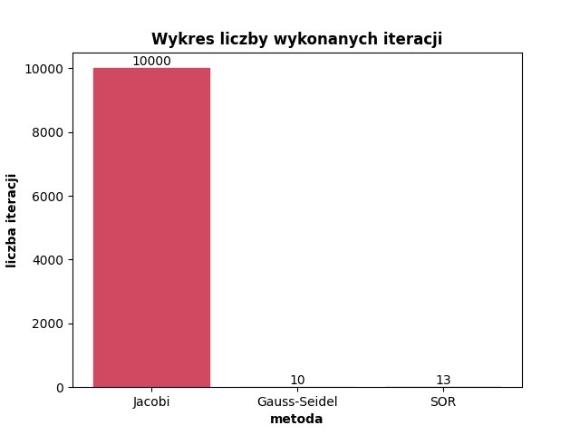
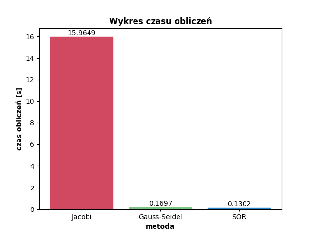

# PD-EXPERIMENTOR

Środowisko badawcze przybliżonych metod stacjonarnych rozwiązywania układów równań liniowych wykorzystujące bibliotekę [equiter](https://github.com/Coolxer/PD-EQUITER-LIBRARY).
---

*Realizacja w ramach pracy dyplomowej "Analiza i realizacja wybranych algorytmów przybliżonego rozwiązywania układów równań liniowych" KRK/13/4028*

***Autor:** Łukasz Miłoś 161883*

---
 
## Zawartość 

Środowisko badwacze powstało w celu przetestowania biblioteki [equiter](https://github.com/Coolxer/PD-EQUITER-LIBRARY).

Najważniejsze cechy środowiska:
- umożliwia generowanie różnego typu macierzy i wektorów o różnej wielkości
- automatycznie rozwiązuje układ równań stacjonarnymi metodami iteracyjnymi
- tworzy pliki wynikowe w postaci tekstowej
- tworzy wykresy graficzne porównujące zbieżność według wskaźnika liczby wykonanych iteracji i czasu obliczeń
- pełna automatyzacja procesu badawczego
- prosta obsługa

System pozwala m.in. na porównanie zbieżności poszczególnych metod iteracyjnych względem badanego układu równań. Możliwość generowania szerokiego spektrum macierzy wejściowych, a co za tym idzie układów, pozwala na przetestowanie skuteczności metod względem różnych typów macierzy wejściowych.

---

## Wymagania

Oprócz samej biblioteki niezbędne są dodatkowe narzędzia:
- interpreter [Python](https://www.python.org/downloads/) (zalecana wersja 3.*)
- biblioteka [NumPy](https://numpy.org/install/) (niekiedy instalowana razem z Python'em)
- biblioteka [SciPy](https://www.scipy.org/install.html)
- biblioteka [tkinter](https://docs.python.org/3/library/tkinter.html) (zazwyczaj instalowana razem z interpreterem, o ile nie odznaczono tej opcji podczas instalacji)
- biblioteka [matplotlib](https://matplotlib.org/stable/users/installing.html)
- dowolny edytor tekstowy (zalecany edytor kodu źródłowego, np. [Visual Studio Code](https://code.visualstudio.com/))

---

## Instalacja

Repozytorium należy pobrać przy pomocy systemu kontroli wersji [git](https://git-scm.com/) albo "ręcznie" w formacie .zip, a następnie wypakować.

Repozytorium zawiera podmoduł o nazwie [PD-EQUITER-LIBRARY](https://github.com/Coolxer/PD-EQUITER-LIBRARY) stanowiący bibliotekę implementującą metody iteracyjne. W związku z tym proces pobierania środowiska badawczego jest nieco bardziej skomplikowany:
- w przypadku korzystania z systemu kontroli wersji git należy pobrać również zależności dotyczące podmodułu. W tym celu do polecenia git clone należy dodać argument --recurse-submodules, tak jak poniżej
```console
git clone --recurse-submodules https://github.com/Coolxer/PD-EXPERIMENTOR
```

- w przypadku "ręcznego" pobierania środowiska katalog PD-EQUITER-LIBRARY zawierający podmoduł będzie pusty. Należy zatem pobrać ten podmoduł samodzielnie [tutaj](https://github.com/Coolxer/PD-EQUITER-LIBRARY), a następnie przenieść go do tego katalogu.

***UWAGA:*** Warto zmienić nazwę katalogu PD-EQUITER-LIBRARY na ***equiter***. Jest to zalecane podejście ze względu na prostotę i możliwość podążania za tym samouczkiem.

***UWAGA:*** Środowisko badawcze powinno być podkatalogiem bieżącego projektu, a więc skrypty wykorzystujące środowisko powinny być wyżej w hierarchii katalogów. Innymi słowy nie należy umieszczać własnych skryptów wewnątrz katalogu środowiska!

***UWAGA:*** Po ściągnięciu środowiska zalecana jest zmiana nazwy głównego katalogu na ***experimentor*** Jest to skrótowa nazwa ułatwiająca korzystanie z biblioteki. Jeśli chcesz podążać dalej za poradnikiem zmiana nazwy jest niezbędna!

Po przygotowaniu biblioteki, we własnym pliku Python (z rozszerzeniem *.py) można przystąpić do importu biblioteki.

```python
import experimentor as exp
```

---

## Jak to działa?

### Przykład

W celu zapoznania się z biblioteką zalecane jest uruchomienie poniższego przykładu

```python
import experimentor as exp

name = "1000x1000"
matrix_type = exp.types["random"]
matrix_size = 1000

exp.experiment(name, matrix_type, matrix_size)

```

Efektem wykonania powyższego kodu będzie wyświetlenie następujących informacji w konsoli / terminalu:

```console
Zapisywanie macierzy ...
Zapisywanie innych parametrow ...
Trwa rozwiazywanie ukladu metoda Jacobiego ...
Trwa rozwiazywanie ukladu metoda Gaussa-Seidela ...
Trwa rozwiazywanie ukladu metoda SOR ...
    SOR: w: 1.1
    SOR: w: 1.3
    SOR: w: 1.5
    SOR: w: 1.7
    SOR: w: 1.9
Zapisywanie rezultatow ...
Generowanie wykresow ...
```

A także wyświetlenie następujących wykresów:




### Omówienie działania

#### Wstęp

Użytkownik podaje 3 parametry funkcji badawczej:
- ***name*** -  nazwę eksperymentu (czyli nazwę katalogu głównego z konfiguracją i wynikami)
  
- ***matrix_type*** - typ macierzy wejściowej układu (wybór ze słownika ***types***), dostępne możliwości to:
  - 'sparse': rzadka, wygenerowana przy pomocy zewnętrznej biblioteki
  - 'random': pełna wygenerowana w sposób losowy
  - 'diagonal': diagonalna, wygenerowana w sposób losowy
  - 'band': wstęgowa (pasmowa) o szerokości 3
  - 'lower_triangular': dolnotrójkątna
  - 'upper_triangular': górnotrójkątna
  - 'external': zewnętrzna, pobrana ze źródeł zewnętrznych

- ***matrix_size*** - rozmiar macierzy wejściowej układu

Z perspektywy użytkownika ważne jest to, że w katalogu ***exp_results***, wewnątrz środowiska utworzony zostanie katalog o grupujący typ macierzy wejściowej (np. random), a wewnątrz tego katalogu powstanie katalog o nazwie eksperymentu, czyli ***name***.

Dla podanego przykładu wewnątrz katalogu ***exp_results*** powstał katalog ***random***, a w nim katalog ***1000x1000***.

#### Konfiguracja

Odpowiednia macierz zostanie wygenerowana, a wektor wyrazów wolnych, o ile nie istnieje (plik może istnieć w katalogu ***exp_results*** o nazwie ***b_[matrix_size]***). Wektor wyrazów wolnych może być dzielony pomiędzy różne eksperymenty, w celu zbadania innych zależności. Wszelkie dane konfiguracyjne zostaną zapisane wewnątrz katalogu doświadczenia, ale w specjalnie przygotowanym katalogu config, czyli:

```console
      experimentor/exp_results/[matrix_type]/[name]/config
```

Pliki konfiguracyjne tworzone w ramach katalogu ***config*** to:
- ***A.txt*** - plik zawierający macierz wejściową układu
- ***general.txt*** - plik zawierający nazwę eksperymentu, typ macierzy i rozmiar układu
- ***parameters.txt*** - plik zawierający dane konfiguracyjne metod, takie jak dokładność obliczeń, maksymalna liczba iteracji, parametr relaksacji

#### Obliczanie

Następnie wykonywane są obliczenia za pomocą stacjonarnych metod przybliżonych rozwiązywania URL przy pomocy biblioteki [equiter](https://github.com/Coolxer/PD-EQUITER-LIBRARY).

#### Wyniki

Wyniki obliczeń zapisywane są wewnątrz katalogu ***results*** o ścieżce:

```console
      experimentor/exp_results/[matrix_type]/[name]/results
```

Wyniki można podzielić na tekstowe i graficzne.

W przypadku wyników tekstowych powstaje folder ***txt***, a wewnątrz niego tworzone są następujące elementy:
- plik ***iterations.txt*** zawierający liczbę wykonanych iteracji przez poszczególne metody niezbędnych do rozwiązania danego układu
- plik ***times.txt*** zawierający czas obliczeń poszczególnych metod
- katalog ***solution*** wewnątrz, którego zostały utworzone pliki tekstowe zawierające wektor rozwiązań układu, osobno dla każdej z metod (jacobi.txt, gauss_seidel.txt, sor.txt)

W przypadku wyników graficznych powstaje folder ***img***, a wewnątrz niego tworzone są następujące elementy:
- ***iterations.png*** - wykres porównujący liczbę wykonanych iteracji przez poszczególne metody dla danego układu
- ***times.png*** - wykres porównujący czas obliczeń poszczególnych metod dla danego układu

---

## Dodatkowe informacje

W przypadku metody SOR badane jest kilka wartości parametru relaksacji, a wynik biorący udział w porównaniu z metodą Jacobiego i metodą Gaussa-Seidela jest najlepszym wynikiem uzyskanym przy pomocy metody SOR. Przyjęto najlepszy rezultat (zamiast najgorszego lub średniej), ponieważ pozostałe metody również dążą do najlepszego rezultatu.