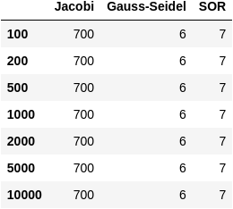

# PD-EXPERIMENTOR

## Środowisko badawcze przybliżonych metod stacjonarnych rozwiązywania układów równań liniowych wykorzystujące bibliotekę [equiter](https://github.com/Coolxer/PD-EQUITER-LIBRARY).

_Realizacja w ramach pracy dyplomowej "Analiza i realizacja wybranych algorytmów przybliżonego rozwiązywania układów równań liniowych" KRK/13/4028_

**\*Autor:** Łukasz Miłoś 161883 \
**\*Promotor:** dr inż. prof. PRz Mariusz Borkowski \
**\*Uczelnia:** Politechnika Rzeszowska im. Ignacego Łukasiewicza \
**\*Jednostka organizacyjna:** Katedra Elektrotechniki i Podstaw Informatyki (ET)

---

## Zawartość

Środowisko badawcze powstało w celu przetestowania biblioteki [equiter](https://github.com/Coolxer/PD-EQUITER-LIBRARY).

Najważniejsze cechy środowiska:

- umożliwia generowanie różnego typu macierzy i wektorów o różnej wielkości
- automatycznie rozwiązuje układ równań stacjonarnymi metodami iteracyjnymi
- tworzy pliki wynikowe w postaci tekstowej
- tworzy wykresy graficzne porównujące zbieżność według wskaźnika liczby wykonanych iteracji i czasu obliczeń
- umożliwia wykonywanie zarówno pojedynczych jak i grupowych eksperymentów
- zapewnia pełną automatyzację procesu badawczego i prostą obsługę

System pozwala m.in. na porównanie zbieżności poszczególnych metod iteracyjnych względem badanego układu równań. Możliwość generowania szerokiego spektrum macierzy wejściowych, a co za tym idzie układów, pozwala na przetestowanie skuteczności metod względem różnych typów macierzy wejściowych.

Wartą uwagi jest możliwość grupowania eksperymentów według typu macierzy wejściowej lub jej stopnia.

---

## Wymagania

Oprócz samej biblioteki niezbędne są dodatkowe narzędzia:

- interpreter [Python](https://www.python.org/downloads/) (zalecana wersja 3.\*)
- biblioteka [NumPy](https://numpy.org/install/) (niekiedy instalowana razem z Python'em)
- biblioteka [SciPy](https://www.scipy.org/install.html)
- biblioteka [tkinter](https://docs.python.org/3/library/tkinter.html) (zazwyczaj instalowana razem z interpreterem, o ile nie odznaczono tej opcji podczas instalacji)
- biblioteka [matplotlib](https://matplotlib.org/stable/users/installing.html)
- biblioteka [pandas](https://pandas.pydata.org/)
- biblioteka [dataframe_image](https://pypi.org/project/dataframe-image/)
- dowolny edytor tekstowy (zalecany edytor kodu źródłowego, np. [Visual Studio Code](https://code.visualstudio.com/))

---

## Instalacja

Repozytorium należy pobrać przy pomocy systemu kontroli wersji [git](https://git-scm.com/) albo "ręcznie" w formacie .zip, a następnie wypakować.

Repozytorium zawiera podmoduł o nazwie [PD-EQUITER-LIBRARY](https://github.com/Coolxer/PD-EQUITER-LIBRARY) stanowiący bibliotekę implementującą metody iteracyjne. W związku z tym proces pobierania środowiska badawczego jest nieco bardziej skomplikowany:

- w przypadku korzystania z systemu kontroli wersji git należy pobrać również zależności dotyczące podmodułu. W tym celu do polecenia git clone należy dodać argument --recurse-submodules, tak jak poniżej

```console
git clone --recurse-submodules https://github.com/Coolxer/PD-EXPERIMENTOR
```

- w przypadku "ręcznego" pobierania środowiska katalog PD-EQUITER-LIBRARY zawierający podmoduł będzie pusty. Należy zatem pobrać ten podmoduł samodzielnie [tutaj](https://github.com/Coolxer/PD-EQUITER-LIBRARY), a następnie przenieść go do tego katalogu.

**_UWAGA:_** Warto zmienić nazwę katalogu PD-EQUITER-LIBRARY na **_equiter_**. Jest to zalecane podejście ze względu na prostotę i możliwość podążania za tym samouczkiem.

**_UWAGA:_** Środowisko badawcze powinno być podkatalogiem bieżącego projektu, a więc skrypty wykorzystujące środowisko powinny być wyżej w hierarchii katalogów. Innymi słowy nie należy umieszczać własnych skryptów wewnątrz katalogu środowiska!

**_UWAGA:_** Po ściągnięciu środowiska zalecana jest zmiana nazwy głównego katalogu na **_experimentor_**. Jest to skrótowa nazwa ułatwiająca korzystanie z biblioteki. Jeśli chcesz podążać dalej za poradnikiem zmiana nazwy jest niezbędna!

Po przygotowaniu biblioteki, we własnym pliku Python (z rozszerzeniem \*.py) można przystąpić do importu biblioteki.\*\*\*\*

```python
import experimentor as exp
```

---

## Jak to działa?

### Przykład

W celu zapoznania się z biblioteką zalecane jest uruchomienie poniższego przykładu

```python
import experimentor as exp

experiment_name = "my_experiment_001"
matrix_type = exp.matrix_type.random
matrix_order = 1000
tolerance = 0.0001
max_iterations = 2000
w_values = [1.1, 1.3, 1.5]

exp.do_single_experiment(experiment_name, matrix_type, matrix_order, tolerance, max_iterations, w_values)
```

Efektem wykonania powyższego kodu będzie wyświetlenie następujących informacji w konsoli / terminalu:

```console
#############################################################
######### Eksperyment:  my_experiment_001 ###########
Generowanie macierzy głównej ...
Generowanie / Wczytywanie wektora wyrazów wolnych ...
Rozwiązywanie układu metodą Jacobiego ...
Rozwiązywanie układu metodą Gaussa-Seidela ...
Rozwiązywanie układu metodą SOR ...
    - dla parametru 'w': 1.1
    - dla parametru 'w': 1.3
    - dla parametru 'w': 1.5
Zapisywanie generalnych informacji o eksperymencie ...
Zapisywanie macierzy głównej ...
Zapisywanie pozostałych parametrów (tolerancji, maks. liczby iteracji) ...
Zapisywanie rezultatów według wskaźnika liczby wyk. iteracji ...
Zapisywanie rezultatów według wskaźnika czasu obliczeń ...
Zapisywanie szczegółowych wyników ...
Generowanie wykresu zbieżności według wskaźnika liczby wyk. iteracji ...
Generowanie wykresu zbieżności według wskaźnika czasu obliczeń ...

Eksperyment my_experiment_001 zakończony sukcesem!
#############################################################
```

A także wyświetlenie następujących wykresów:


### Omówienie działania

#### Wstęp

Użytkownik podaje 6 lub 7 parametrów funkcji badawczej , gdy chce wykonać pojedynczy eksperyment:

- **_experiment_name_** (str) - nazwę eksperymentu (czyli nazwę katalogu głównego z konfiguracją i wynikami)
- **_matrix_type_** (wybór opcji) - typ macierzy wejściowej układu:

  - 'band': wstęgowa (pasmowa) o szerokości 3
  - 'diagonal': diagonalna, wygenerowana w sposób losowy
  - 'external': zewnętrzna, pobrana ze źródeł zewnętrznych
  - 'full': pełna wygenerowana w sposób losowy
  - 'sparse': rzadka, wygenerowana w sposób losowy

- **_matrix_order_** (int) - stopień macierzy wejściowej układu
- **_tolerance_** (int / float) - dokładność przybliżonego rezultatu
- **_max_iterations_** (int) - maksymalna liczba iteracji
- **_w_values_** (list) - lista wartości parametru 'w' do przetestowania
- **_create_charts_** (bool) [True] - czy wykresy mają zostać wygenerowane

Z perspektywy użytkownika ważne jest to, że w katalogu **_data_**, wewnątrz środowiska, zostanie utworzony katalog o nazwie eksperymentu, czyli **_name_**.

#### Konfiguracja

Odpowiednia macierz zostanie wygenerowana, podobnie jak wektor wyrazów wolnych, o ile nie istnieje (plik może już istnieć w katalogu **_data_** o nazwie **_b\_[matrix_order]_**). Wektor wyrazów wolnych może być bowiem dzielony pomiędzy różne eksperymenty, w celu zbadania innych zależności. Wszelkie dane konfiguracyjne zostaną zapisane wewnątrz katalogu doświadczenia, ale w specjalnie przygotowanym katalogu config, czyli:

```console
      experimentor/data/[experiment_name]/config
```

Pliki konfiguracyjne tworzone w ramach katalogu **_config_** to:

- **_A.txt_** - plik zawierający macierz wejściową układu
- **_general.txt_** - plik zawierający nazwę eksperymentu, typ macierzy i rozmiar układu
- **_parameters.txt_** - plik zawierający dane konfiguracyjne metod, takie jak dokładność obliczeń, maksymalna liczba iteracji, parametr relaksacji

#### Obliczenia

Następnie wykonywane są obliczenia za pomocą stacjonarnych metod przybliżonych rozwiązywania URL, przy pomocy biblioteki [equiter](https://github.com/Coolxer/PD-EQUITER-LIBRARY).

#### Wyniki

Wyniki obliczeń zapisywane są wewnątrz katalogu **_results_** o ścieżce:

```console
      experimentor/data/[experiment_name]/results
```

Wyniki można podzielić na tekstowe i graficzne.

W przypadku wyników tekstowych powstaje folder **_txt_**, a wewnątrz niego tworzone są następujące elementy:

- plik **_iterations.txt_** zawierający liczbę wykonanych iteracji niezbędnych do rozwiązania danego układu przez poszczególne metody
- plik **_times.txt_** zawierający czas obliczeń poszczególnych metod
- katalog **_solution_** wewnątrz, którego zostały utworzone pliki tekstowe zawierające wektor rozwiązań układu, osobno dla każdej z metod (jacobi.txt, gauss_seidel.txt, sor.txt)

W przypadku wyników graficznych powstaje folder **_img_**, a wewnątrz niego tworzone są następujące elementy:

- **_iterations.png_** - wykres porównujący liczbę wykonanych iteracji przez poszczególne metody dla danego układu
- **_times.png_** - wykres porównujący czas obliczeń poszczególnych metod dla danego układu

---

### Eksperymenty grupowe

Do środowiska dodano także możliwość tworzenia grupowych doświadczeń (metoda **do_group_experiment** ), tzn.:

- grupowanych według typu macierzy wejściowej A (stały typ, zmienny stopień macierzy)
- grupowanych według stopnia macierzy wejściowej A (stały stopień, zmienny typ macierzy)

Użytkownik decyduje jakie wartości parametrów chce przetestować, a co jest bardzo istotne ma także możliwość dzielenia doświadczenia na różne etapy, tzn. w jednej chwilii nie musi testować całego zakresu parametrów, ponieważ może dopisać kolejne wyniki do już istniejących. Jest to szczególnie przydatne w przypadku czasochłonnych obliczeń.

W związku z możliwością podziału eksperymentu na kilka etapów, wykresy mogą być generowane nie tylko bezpośrednio podczas eksperymentu, ale także już po jego zakończeniu, ponieważ dostępna jest do tego specjalna metoda **make_group_charts_and_tables**.

Warto zwrócić uwagę także na tworzenie dodatkowych tabel dla grupowych doświadczeń w celu czytelniejszej prezentacji danych.

Zasada działania tych metod jest bardzo prosta. Metoda służąca do wykonywania grupowych eksperymentów ma podobne parametry, co metoda służąca do jednostkowych doświadczeń. Natomiast metoda do generacji wykresów grupowych jako argument przyjmuje tylko nazwę eksperymentu. Zainteresowanych odsyłam do kodu źródłowego po więcej szczegółów.

Poniżej przykładowe wygenerowane wykresy dla pewnego eksperymentu grupowanego według typu macierzy pełnej. Badane stopnie macierzy wejściowej to 100, 200, 500, 1000, 2000, 5000, 10000:


oraz tabelami wartości na tych wykresach:




## Dodatkowe informacje

W przypadku metody SOR badane jest kilka wartości parametru relaksacji (podanych przez użytkownika), a wynik biorący udział w porównaniu z metodą Jacobiego i metodą Gaussa-Seidela jest najlepszym wynikiem uzyskanym przy pomocy metody SOR. Przyjęto najlepszy rezultat (zamiast najgorszego lub średniej), ponieważ pozostałe metody również dążą do najlepszego wyniku.
